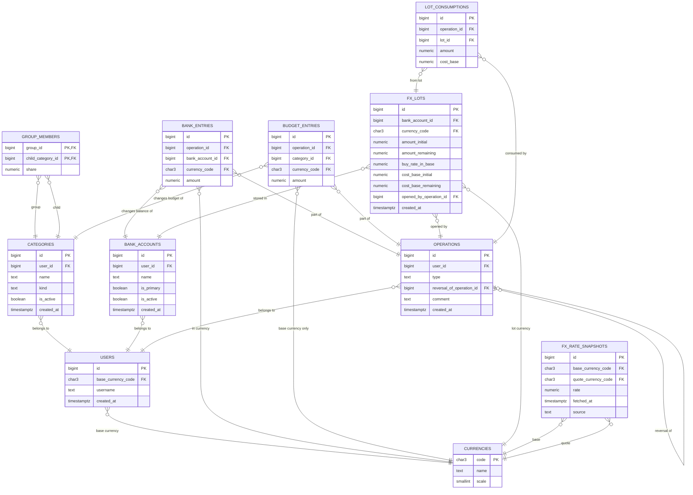

# Bank and Budget Data Model

Схема данных для модели, где:
- у пользователя есть общий мультивалютный банк;
- категории являются только бюджетными конвертами в базовой валюте пользователя;
- группы остаются категориями и распределяют бюджет по дочерним категориям;
- расход можно отнести на любую категорию, но валюта физически списывается из общего банка;
- изменение рыночного курса не меняет категории и не создает бухгалтерских операций;
- текущая стоимость всех денег в любой валюте считается только на чтение, по запросу.

## Основная идея

Есть два независимых слоя учета:

- `bank_*` таблицы отвечают за реальные деньги и валютные лоты;
- `budget_*` таблицы отвечают за бюджет по категориям в базовой валюте пользователя.

Это позволяет:
- не привязывать USD/EUR/CNY к конкретной категории;
- тратить `50 USD` с категории `Путешествия`, если в банке есть `50 USD`;
- уменьшать категорию не на `50 USD`, а на историческую себестоимость этих `50 USD` в базовой валюте.

## Диаграмма связей

## Кратко по таблицам

- `currencies` — справочник валют.
- `users` — пользователь и его базовая валюта.
- `categories` — бюджетные категории пользователя: `regular`, `group`, `income`, `system`.
- `group_members` — состав групп и доли распределения.
- `bank_accounts` — реальные счета пользователя; в первой версии можно иметь один основной счет.
- `operations` — шапка бизнес-операции: `income`, `allocate`, `group_allocate`, `exchange`, `expense`, `transfer`, `reversal`.
- `bank_entries` — фактические изменения остатков банка по валютам.
- `budget_entries` — изменения бюджетов категорий, всегда в базовой валюте пользователя.
- `fx_lots` — валютные лоты банка с исторической себестоимостью.
- `lot_consumptions` — какие лоты были списаны при расходе, переводе или обмене.
- `fx_rate_snapshots` — рыночные курсы для отчетной оценки в любой валюте.

## Как работает эта модель

### Доход

- увеличивает реальные деньги в `bank_entries`;
- увеличивает доступный к распределению бюджет в системной категории, например `Unallocated`, через `budget_entries`.

### Распределение по категориям

- двигает бюджет между категориями в базовой валюте;
- банк при этом не меняется.

### Обмен валюты

- меняет только структуру денег в банке;
- категории не меняет;
- при покупке небазовой валюты создает `fx_lots`;
- при продаже небазовой валюты списывает лоты по `FIFO`.

### Расход

- проверяет наличие нужной валюты в банке;
- если валюты недостаточно, операция запрещается;
- списывает валюту из банка;
- считает историческую себестоимость списанного объема в базовой валюте;
- на эту себестоимость уменьшает выбранную категорию через `budget_entries`.

### Reversal

- не удаляет старую операцию;
- создает новую операцию с типом `reversal`;
- зеркалит `bank_entries` и `budget_entries`;
- восстанавливает или повторно закрывает лоты на основании `lot_consumptions`.

## Важные правила

- Категории не переоцениваются при изменении рынка.
- Нереализованная курсовая разница не попадает в категории.
- Рыночный курс используется только для отчетов.
- Текущая стоимость всех денег в `RUB`, `USD`, `CNY` и любой другой валюте считается по запросу, без записи новых операций.
