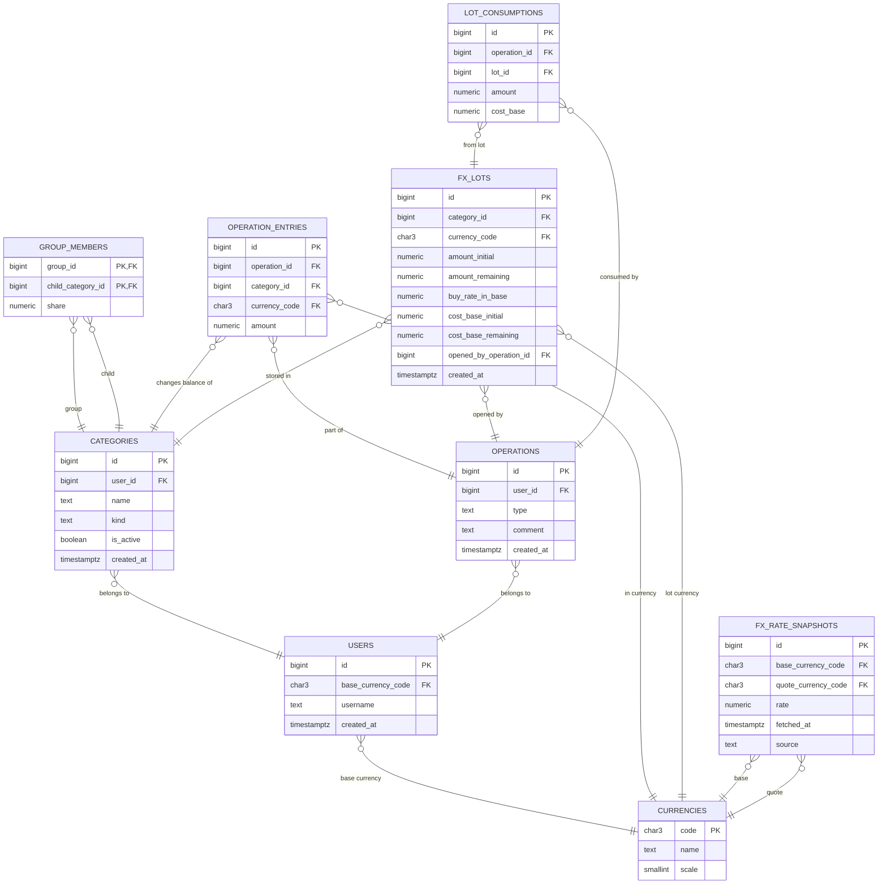

# Currency-Aware Data Model

Ниже схема данных для версии, где:
- категория остается основной сущностью;
- группа тоже является категорией;
- базовая валюта задается на уровне пользователя;
- обычная категория может хранить несколько валют;
- валютные покупки хранятся как лоты с исторической себестоимостью в базовой валюте пользователя.

## Диаграмма связей

## Кратко по таблицам

- `users` хранит пользователя и его базовую валюту.
- `currencies` хранит справочник валют.
- `categories` хранит все категории пользователя, включая группы.
- `group_members` хранит состав групп и доли распределения.
- `operations` хранит бизнес-операцию целиком.
- `operation_entries` хранит движения по категориям и валютам.
- `fx_lots` хранит валютные лоты по исторической себестоимости в базовой валюте пользователя.
- `lot_consumptions` хранит списание лотов при тратах и переводах.
- `fx_rate_snapshots` хранит рыночные курсы для оценки текущей стоимости остатков в базовой валюте пользователя.

## Основные правила модели

- `categories.kind = 'group'` не хранит деньги напрямую, а только распределяет пополнение по дочерним категориям.
- `categories.kind = 'regular'` может хранить сразу несколько валют.
- Обмен валюты внутри категории создает валютный лот в `fx_lots`.
- Курс обмена считается автоматически как `amount_from / amount_to`.
- Трата валюты списывает лоты по правилу `FIFO`.
- Баланс категории можно считать в двух видах: по исторической себестоимости и по текущему рыночному курсу.
